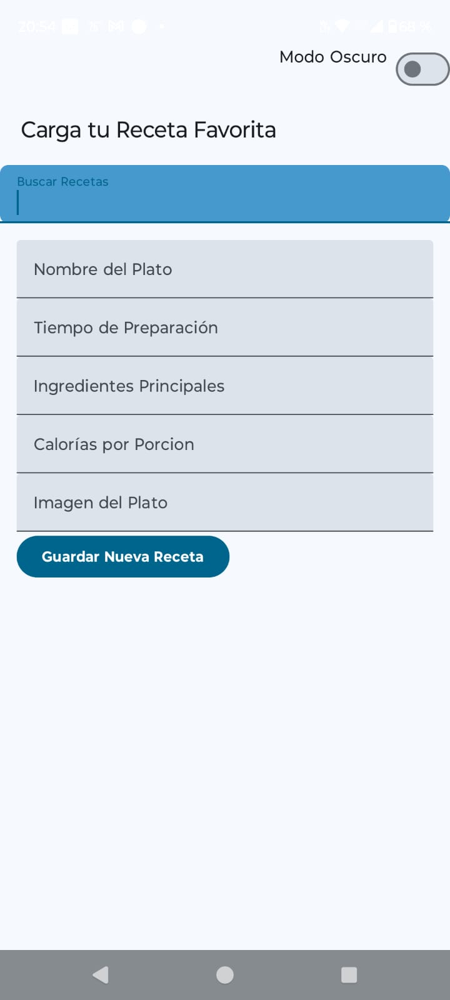
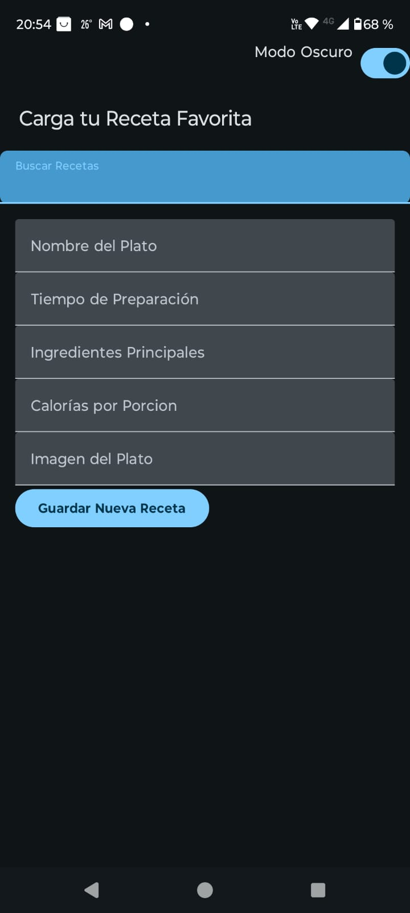
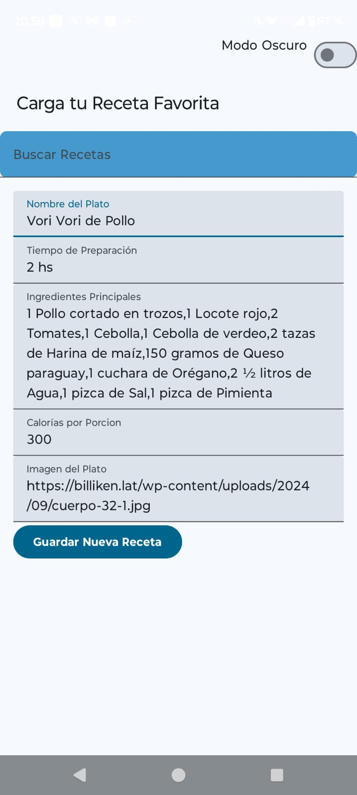
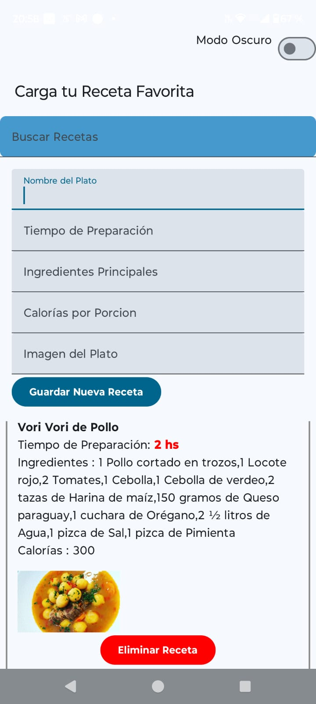
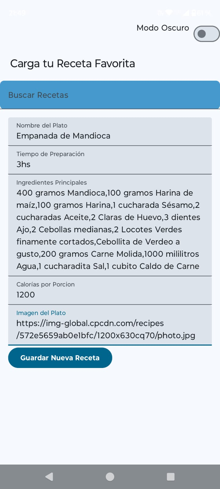
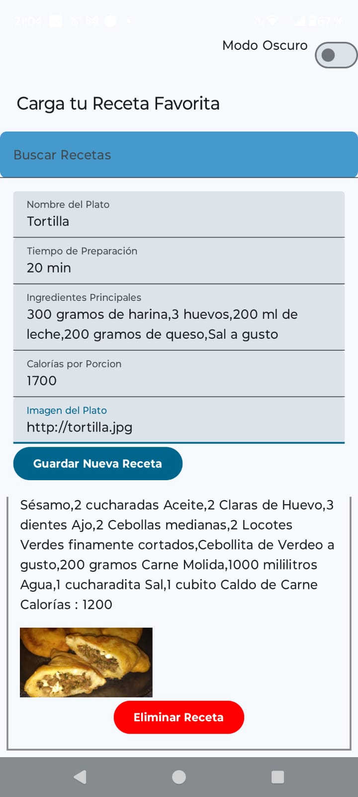
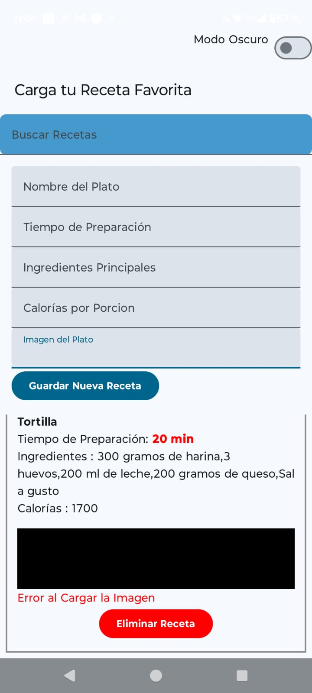

# Aplicación Android de Registro de Recetas

##Objetivo
Desarrollar una aplicación Android para gestionar el registro de recetas de cocina.

1. [Vista Principal Modo Claro](#dVista-Principal-Modo-Claro)
2. [Vista Principal Modo Oscuro](#dVista-Principal-Modo-Oscuro)
3. [Carga de Receta](#Carga-de-Receta)
4. [Eliminar Receta](#Eliminar-Receta)
5. [Buscar Recetas](#Buscar-Recetas)

## 1. Vista Principal Modo Claro

## 2. Vista Principal Modo Oscuro

## 3. Carga de Receta
Pueden Ingresarse:
  - Nombre del Plato.
  - Tiempo de Preparación.
  - Ingredientes Principales.
  - Calorias por Porción.
  - Url de la Imagen

Despues de ingresar todos los datos se debe presionar el boton Guardar Nueva Receta. Y se visualizara la receta en la grilla de abajo, donde se tiene la opción de Eliminar la receta desde el botón.

Para los casos de Ejemplo se cargaran Tres recetas, 

## Receta Caso 1, se cargan todos los datos.

## Receta Caso 2, se cargan tambien todos los datos.

## Receta Caso 3, se cargan todos los datos y la URL no es valida. Se muestra una imagen en negro con el mensaje de Error.

